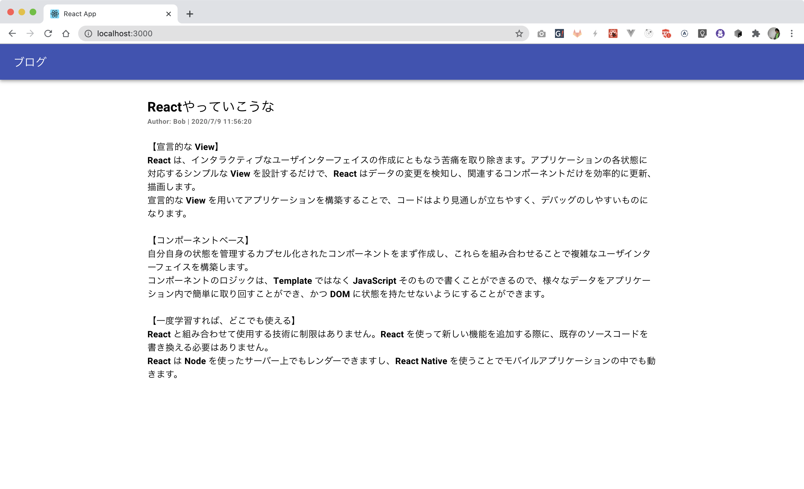
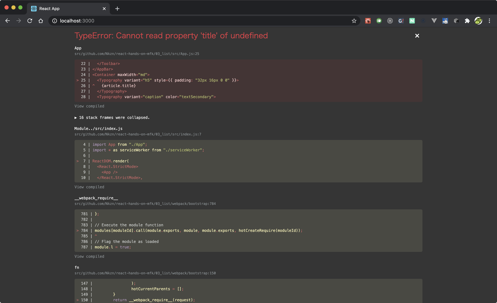
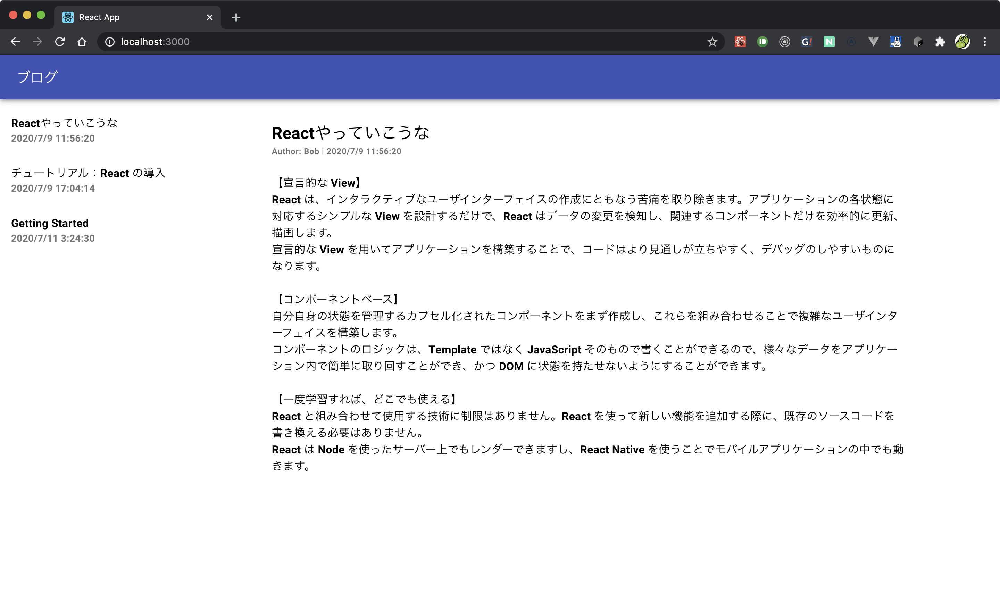
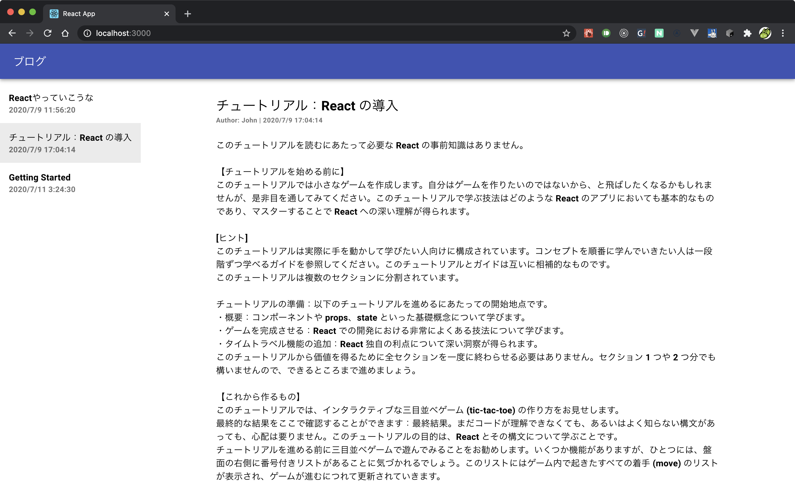
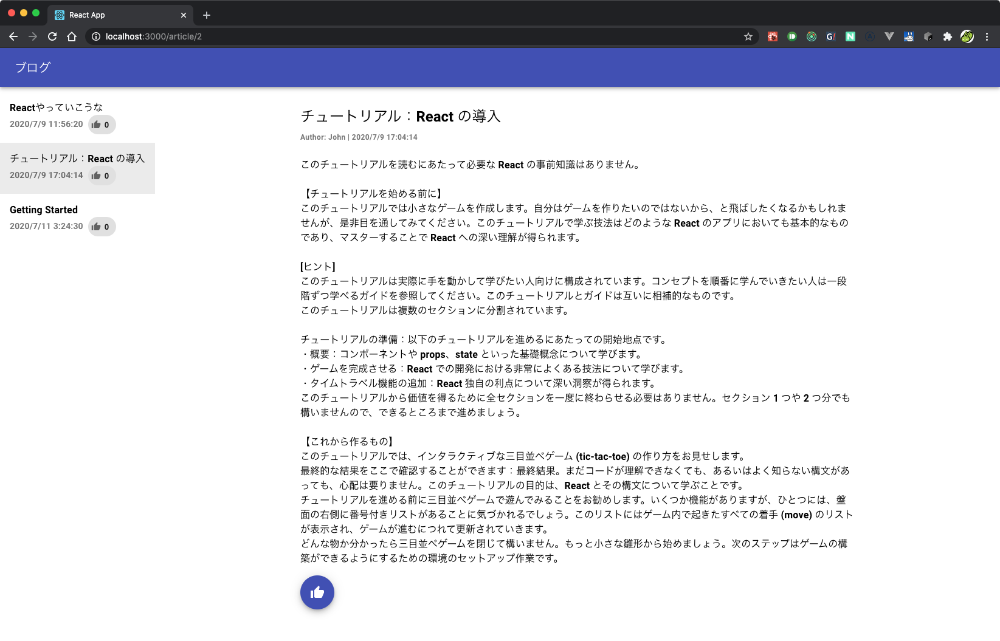
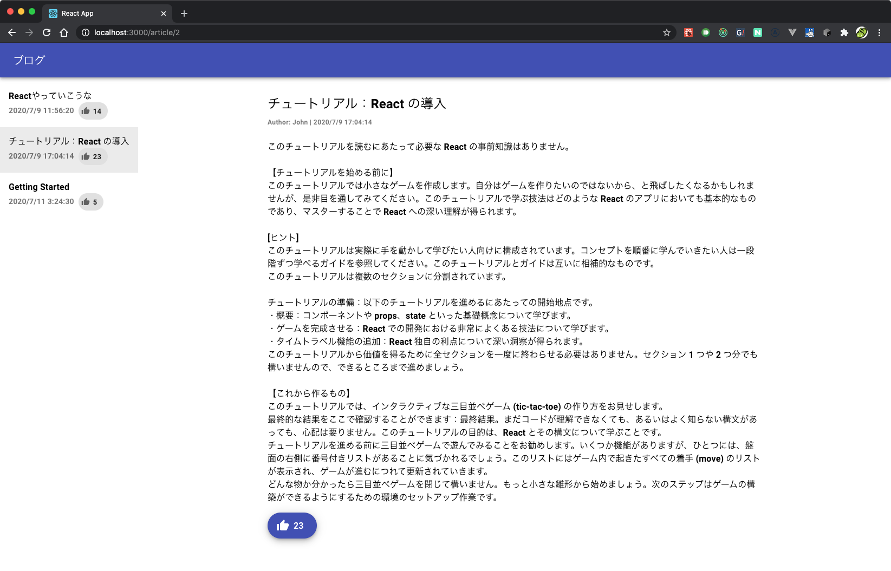

Reactハンズオン
==========

簡単なブログ風Webサイトを作ってみよう

* 関数コンポーネント + React Hooksを前提とします
* Nkznの趣味で[Material UI](https://material-ui.com/)を使っていますが他のUIライブラリでも構いません

## 0. 環境構築

* Node.js 10, 12, 14のどれかが入っていること（やりたい人はyarnでもいいです）
* [ESLintプラグイン](https://marketplace.visualstudio.com/items?itemName=dbaeumer.vscode-eslint)をインストールする
* [Prettierプラグイン](https://marketplace.visualstudio.com/items?itemName=esbenp.prettier-vscode)をインストールする
* `npx create-react-app react-hands-on`
* `npm install prettier eslint@6.6.0 --save-dev`
* `"prettier": "prettier --write \"src/**/*.{js,jsx,ts,tsx,json,css,scss,md}\""` をnpm scriptsに追記
* [Prettier向けのESLint設定](https://github.com/prettier/eslint-plugin-prettier/blob/master/README.md#installation)を行う
* `.eslintrc.js`
  - ```js
    module.exports = {
        extends: ["react-app", "plugin:prettier/recommended"]
    };
    ```
* `npm run eslint`
* `npm run prettier`
* `npm run eslint`

まで設定したものが *1. 記事ページを作る* の初期状態です

## 1. 記事ページを作る



* ダミーデータはファイルに直に記入してある
* Material UIはインストール済み
* タイトルと本文のコンポーネントは配置済み

### Try

* データにauthorとdateがあるので、タイトルの下に追記してみよう
* VSCodeでPrettierによる自動フォーマットの恩恵が得られることを確認しよう
* VSCodeでESLintによるチェックの恩恵が得られることを確認しよう

まずは `author` だけ。

```js
<Typography variant="caption" color="textSecondary">
  Author: {article.author}
</Typography>
```

次は `date` も追記。

```js
<Typography variant="caption" color="textSecondary">
  Author: {article.author} | {article.date}
</Typography>
```

「`} | {`」でちょっと目が滑りますが、特に何かの文法というわけではなく、テキストの飾りとして置いているだけです。

`date` がISO 8601のままというのもアレなので、雑に整形します。

```js
<Typography variant="caption" color="textSecondary">
  Author: {article.author} | {new Date(article.date).toLocaleString()}
</Typography>
```

`{}` の中にJavaScriptの式がそのまま書けるのは、Reactの良いところです。

### Point

* ある程度整備されたUIコンポーネントがあると便利なのです
* 日付の整形には、本来何かのライブラリを使うべきです
    - momentjs一強の時代は終わって、TypeScriptと相性の良いライブラリが群雄割拠しています
    - Date操作関数群の[date-fns](https://date-fns.org/)あたりが強いです

## 2. データフェッチを伴う記事ページを作る

* ダミーデータがAPIクライアントの中に入った

### Try

* サーバーから取得したデータで記事ページを初期化しよう
* 「読み込み中」を表現してみよう
* 複数のフックをカスタムフックに切り出して、コンポーネントをスッキリさせよう

`src/data/apiclient.js` の `fetchArticle` 関数でデータを取得できます。

まずはデータが取れることを確認しましょう。 `useEffect` の中でPromiseの結果を受け取り、 `console.log` に出力します。

```js
import React, { useEffect } from "react";
import { fetchArticle } from "./data/apiclient";

function App() {
  useEffect(() => {
    fetchArticle().then((article) => {
      console.log({ article });
    });
  }, []);

  return (
```

確認できたら、次はコンポーネントの表示に反映させます。データの置き場所として `useState` を設置しましょう。上のほうにベタ書きしていた `article` 変数はお役御免ですので併せて削除してください。

```js
import React, { useEffect, useState } from "react";

function App() {
  const [article, setArticle] = useState();

  useEffect(() => {
    fetchArticle().then((_article) => {
      setArticle(_article);
    });
  }, []);

  return (
```

さて、これで行けそうな気がしますが、残念ながらダメです。



`useEffect` は一度コンポーネントが描画された**あと**で動く副作用なので、「1周目」の時点では `article` が `undefined` なのです。

1周目はいわゆる「読み込み中」の状態なので、その間は別の表示をして、ユーザーに待ってもらいましょう。

```js
  useEffect(() => {
    fetchArticle().then((_article) => {
      setArticle(_article);
    });
  }, []);

  if (!article) {
    return <div>loading...</div>;
  }

  return (
```

React Hooksは原理上、常に評価されなければならないので、関数の処理を中断するような条件分岐はすべてのフック定義のあとに記述することになります。

さて、いくらかショボいことには目を瞑れば、ひとまず表示はできました。

そろそろ `App` の中が込み入ってきたので、記事部分を `Article` コンポーネントに分離する形でリファクタリングしましょう。

```js
// Article.js
import React, { useEffect, useState } from "react";
import Typography from "@material-ui/core/Typography";
import Container from "@material-ui/core/Container";
import { fetchArticle } from "./data/apiclient";

export function Article() {
  const [article, setArticle] = useState();

  useEffect(() => {
    fetchArticle().then((_article) => {
      setArticle(_article);
    });
  }, []);

  if (!article) {
    return <div>loading...</div>;
  }

  return (
    <Container maxWidth="md">
      <Typography variant="h5" style={{ padding: "32px 16px 0 0" }}>
        {article.title}
      </Typography>
      <Typography variant="caption" color="textSecondary">
        Author: {article.author} | {new Date(article.date).toLocaleString()}
      </Typography>
      <Typography
        variant="body1"
        paragraph
        style={{
          // refs: https://github.com/mui-org/material-ui/issues/9189
          whiteSpace: "pre-line",
        }}
      >
        {article.text}
      </Typography>
    </Container>
  );
}
```

```js
// App.js
import React from "react";
import AppBar from "@material-ui/core/AppBar";
import Toolbar from "@material-ui/core/Toolbar";
import Typography from "@material-ui/core/Typography";
import { Article } from "./Article";

function App() {
  return (
    <div style={{ flexGrow: 1 }}>
      <AppBar position="static">
        <Toolbar>
          <Typography variant="h6">ブログ</Typography>
        </Toolbar>
      </AppBar>
      <Article />
    </div>
  );
}

export default App;
```

これで `Article` コンポーネントは「描画すると自発的に通信して取得した記事データを表示するコンポーネント」という責務を持つことになりました。インポートも関連するものに整理されましたね。

さて、Presentation Domain Seperation的な「凝集度が高く結合度が低い（疎結合な）設計」を考えると、通信に関する処理はUI定義からできるだけ遠ざけたほうが良いので、APIクライアントを使っている部分をカスタムフックに括り出しましょう。

```js
// src/hooks/article.js
import { useEffect, useState } from "react";
import { fetchArticle } from "./data/apiclient";

export function useArticle() {
  const [article, setArticle] = useState();

  useEffect(() => {
    fetchArticle().then((_article) => {
      setArticle(_article);
    });
  }, []);

  return {
    article,
  };
}
```

```js
// src/App.js
import React from "react";
import { useArticle } from "./hooks/article";

export function Article() {
  const { article } = useArticle();

  if (!article) {
    return <div>loading...</div>;
  }
```

これで `Article` はAPIクライアントの存在を関知しないコンポーネントになりました。

### Point

* `useEffect` を起点として、通信のような非同期処理を行うことができる
* 画面表示の切り替えには高確率で `useState` が絡む
* 通常の関数と同様に、責務単位で関数を抽出することによって、疎結合な設計を実現できる

## 3. 記事一覧を作成する



* 記事一覧がAPIクライアントから取得できるようになった

### Try

* 記事一覧を取得するカスタムフックを作成しよう
* 記事一覧のUIを並べてみよう

さて、次は記事一覧のUIを作成していきますが、APIクライアントがすでにあるということなので、先にカスタムフックを作ってしまいましょう。 `useArticle` と同じファイルに同じ方針で作れそうです（高凝集なコードの旨みですね）。

```js
import { fetchArticle, fetchArticles } from "../data/apiclient";

export function useArticles() {
  const [articles, setArticles] = useState();

  useEffect(() => {
    fetchArticles().then((_articles) => {
      setArticles(_articles);
    });
  }, []);

  return {
    articles,
  };
}
```

次に `useArticles` を使って `ArticleList` コンポーネントを作ってみましょう。

```js
import React from "react";
import List from "@material-ui/core/List";
import ListItem from "@material-ui/core/ListItem";
import ListItemText from "@material-ui/core/ListItemText";
import { useArticles } from "./hooks/article";

export function ArticleList() {
  const { articles } = useArticles();

  if (!articles) {
    return <div>Loading...</div>;
  }

  return (
    <List component="nav">
      {articles.map((articleSummary) => (
        <ListItem key={articleSummary.id} button>
          <ListItemText
            primary={articleSummary.title}
            secondary={new Date(articleSummary.date).toLocaleString()}
          />
        </ListItem>
      ))}
    </List>
  );
}
```

データ数が少ない場合は `map` で配列からJSX要素を量産するのが一般的です。データ数が多い場合は画面外のデータを描画しないようにreact-virtualizedなどを利用します。

では、 `App` に記事一覧を配置してみましょう。

```js
import React from "react";
import AppBar from "@material-ui/core/AppBar";
import Toolbar from "@material-ui/core/Toolbar";
import Typography from "@material-ui/core/Typography";
import { ArticleList } from "./ArticleList";
import { Article } from "./Article";

function App() {
  return (
    <div style={{ flexGrow: 1 }}>
      <AppBar position="static">
        <Toolbar>
          <Typography variant="h6">ブログ</Typography>
        </Toolbar>
      </AppBar>
      <div style={{ display: "flex", flexDirection: "row" }}>
        <ArticleList />
        <Article />
      </div>
    </div>
  );
}

export default App;
```

### Point

* Hooks周りの復習
* リスト表示に慣れる
* 余力がある人は[react-virtualized](https://github.com/bvaughn/react-virtualized)でリストを作ってもよい

## 4. 記事を切り替える



* 記事リストをクリックしたときに記事が切り替わるようにしたい

### Try

* 上位のコンポーネントに選択中の記事を通知しよう
* 任意の記事を表示するために、記事コンポーネントを分離して記事IDのpropsで切り替えられるようにしよう
* 上位のコンポーネントから記事コンポーネントに記事IDを流そう

まずは記事リストをクリックしたときに選択状態が保持されるようにしてみましょう。

```js
// src/ArticleList.js
export function ArticleList() {
  const { articles } = useArticles();
  const [selectedArticleId, setSelectedArticleId] = useState(null);

  useEffect(() => {

  }, []);

  const onClickItem = (articleSummary) => {
    setSelectedArticleId(articleSummary.id);
  };

  if (!articles) {
    return <div>Loading...</div>;
  }

  return (
    <List component="nav">
      {articles.map((articleSummary) => (
        <ListItem
          key={articleSummary.id}
          button
          selected={selectedArticleId === articleSummary.id}
          onClick={() => onClickItem(articleSummary)}
        >
          <ListItemText
            primary={articleSummary.title}
            secondary={new Date(articleSummary.date).toLocaleString()}
          />
        </ListItem>
      ))}
    </List>
  );
}
```

`selected` によって、最後にクリックした項目がハイライトされるようになりましたね。

初期状態では何も選択されないので、通信が終わった時点で先頭の記事を選択するための `useEffect` を仕込んでおきましょう。

```js
// src/ArticleList.js
const [selectedArticleId, setSelectedArticleId] = useState(null);

useEffect(() => {
  if (articles && articles.length > 0 && selectedArticleId === null) {
    setSelectedArticleId(articles[0].id);
  }
}, [articles, selectedArticleId, setSelectedArticleId]);

const onClickItem = (articleSummary) => {
  setSelectedArticleId(articleSummary.id);
};
```

ここで困ったことが起きました。記事一覧はいい感じに動くようになってきた気がしますが、選択中の記事IDを記事コンポーネントに伝える方法がありません。

Reactあるあるとして「親子間でデータを受け渡すことはできるが、子同士ではできない」という罠があります。

「選択中の記事ID」という状態は、親である `App` に持たせることにしましょう。 

```js
// src/App.js
function App() {
  const [selectedArticleId, setSelectedArticleId] = useState(null);

  const onArticleSelected = (selectedArticle) => {
    setSelectedArticleId(selectedArticle.id);
  };

  return (
    <div style={{ flexGrow: 1 }}>
      <AppBar position="static">
        <Toolbar>
          <Typography variant="h6">ブログ</Typography>
        </Toolbar>
      </AppBar>
      <div style={{ display: "flex", flexDirection: "row" }}>
        <ArticleList
          selectedArticleId={selectedArticleId}
          onArticleSelected={onArticleSelected}
        />
        <Article />
```

```js
// src/ArticleList.js
export function ArticleList(props) {
  const { articles } = useArticles();
  const { selectedArticleId, onArticleSelected } = props;

  useEffect(() => {
    if (articles && articles.length > 0 && selectedArticleId === null) {
      onArticleSelected(articles[0]);
    }
  }, [articles, onArticleSelected, selectedArticleId]);

  const onClickItem = (articleSummary) => {
    onArticleSelected(articleSummary);
  };

  if (!articles) {
    return <div>Loading...</div>;
  }
```

この形であれば、 `Article` にもpropsを経由して `selectedArticleId` を流し込むことができますね。

```js
// src/App.js
<Article id={selectedArticleId} />
```

`Article` で表示すべき記事のIDが外部からもらえることになったので、これに合わせて色々と変更します。

```js
// src/Article.js
export function Article(props) {
  const { id } = props;
  const { article } = useArticle(id);

  if (!article) {
    return <div>loading...</div>;
  }
```

```js
// src/hooks/article.js
export function useArticle(id) {
  const [article, setArticle] = useState();

  useEffect(() => {
    setArticle(void 0); // 切り替え時に一度初期化する
    fetchArticle(id).then((_article) => {
      setArticle(_article);
    });
  }, [id]);

  return {
    article,
  };
}
```

これで記事一覧をクリックするたびに記事が切り替わるようになりました。

### Point

* ライブラリを使わなくても画面の切り替えはできる（URLは変わらないけど）
* depsをちゃんと書かないとESLintに怒られる

## 5. URLと画面切り替えを同期する

* [react-router-dom](https://reactrouter.com/web/guides/quick-start)をインストール済み
    - `npm install react-router-dom`

### Try

* パスとコンポーネントの紐付けを定義しよう

```js
// src/index.js
import { BrowserRouter } from "react-router-dom";

ReactDOM.render(
  <React.StrictMode>
    <BrowserRouter>
      <App />
    </BrowserRouter>
  </React.StrictMode>,
  document.getElementById("root")
);
```

```js
// src/App.js
import { Switch, Route } from "react-route-dom";

function App() {
  return (
    <div style={{ flexGrow: 1 }}>
      <AppBar position="static">
        <Toolbar>
          <Typography variant="h6">ブログ</Typography>
        </Toolbar>
      </AppBar>
      <div style={{ display: "flex", flexDirection: "row" }}>
        <ArticleList />
        <Switch>
          <Route component={Article} path="/article/:articleId" />
        </Switch>
      </div>
    </div>
  );
}
```

```js
// src/ArticleList.js
import { Link, useParams, useHistory } from "react-router-dom";

export function ArticleList() {
  const { articles } = useArticles();
  const location = useLocation();
  const history = useHistory();

  useEffect(() => {
    // ルートパスにアクセスしたら1つめの記事にリダイレクトする
    if (articles && articles.length > 0 && location.pathname === "/") {
      history.replace(`/article/${articles[0].id}`);
    }
  }, [articles, history, location.pathname]);

  if (!articles) {
    return <div>Loading...</div>;
  }

  // パス（ex. /article/1）から記事IDを抽出する
  const match = location.pathname.match(/\/article\/([0-9]+)/);
  const articleId = match ? parseInt(match[1]) : null;

  return (
    <List component="nav">
      {articles.map((articleSummary) => (
        <ListItem
          key={articleSummary.id}
          button
          selected={articleId === articleSummary.id}
          component={Link}
          to={`/article/${articleSummary.id}`}
        >
          <ListItemText
            primary={articleSummary.title}
            secondary={new Date(articleSummary.date).toLocaleString()}
          />
        </ListItem>
      ))}
    </List>
  );
}
```

```js
// src/Article.js
import { useParams } from "react-router-dom";

export function Article() {
  const { articleId } = useParams();
  const { article } = useArticle(parseInt(articleId));
```

### Point

* ライブラリを使うと画面切り替えとURL切り替えを容易に同期させられる
* 手作りもできるけどしんどいので積極的にライブラリを使うと良い

## 6. Reduxでグローバルな状態を共有する



* [redux](https://redux.js.org/), [react-redux](https://react-redux.js.org/), [redux-toolkit](https://redux-toolkit.js.org/)をインストール済み
    - `npm install redux react-redux @reduxjs/toolkit`
* `@material-ui/icons` をインストール済み
    - `npm install @material-ui/icons`

### Try

* Redux環境を構築しよう
* 記事へのいいね！数をReduxに通知しよう
* Redux管理下の情報を各コンポーネントで利用しよう

Reduxはアプリ全体で共有したい情報をアプリ内に配信したい場合に便利なツールです。

まずはReduxの環境構築をしましょう。ボイラープレートが多めなのでサクサク行きます。

store内のデータを分割統治するための仕組みであるReducerは、複数登録することができます。今はひとつもReducerがないので、Reducer置き場をから実装しておきましょう。

```js
// src/redux/rootReducer.js
import { combineReducers } from "@reduxjs/toolkit";

const rootReducer = combineReducers({
  // あとでここにReducerを並べる
});

export default rootReducer;
```

次はstoreを構築します。Middlewareを使わない限りは、概ね次のような形になります。

```js
// src/redux/store.js
import { configureStore } from "@reduxjs/toolkit";

import rootReducer from "./rootReducer";

const store = configureStore({
  reducer: rootReducer,
});

export default store;
```

これでRedux側の空実装ができました。この時点で、 `store` オブジェクトは次の機能を実行できます。

* `store.dispatch()` による更新依頼の発送
* `store.getState()` による状態の取得
* `store.subscribe()` による状態変更の監視

更新依頼を受け取ってstateを保存する役割を担っているReducerが空実装なので、実際には何も起きない（強いて言えば `getState` で `{}` が返ってくる）のですが、ひとまず環境構築としてはOKです。

さて、Reduxは本来、次のような使い方をします。

1. `subscribe` で状態監視を行う
2. ボタンクリック等を起点として更新依頼である `dispatch` を実行する
3. dispatchの内容（action）を受け取ったReducerが新しいstateを生成する
4. stateが更新されたことを `subscribe` のコールバックで検知する
5. `getState` から取り出したデータを使ってUIを更新する

上記の使い方をする限り、あらゆるUIフレームワークと併用できるのですが、それではさほど使いやすいとは言えません。せっかくのReactなので、更新があったら勝手に上から新しいデータが流れてきて、それを表示するだけにしたいですよね。

そこで、Reduxが持っているstateオブジェクトとdispatch関数オブジェクトを、Context API経由で良い感じにReactに流し込んで、どこからでも状態の参照と更新ができるようにしたのが、react-reduxというライブラリです。

というわけで、react-reduxのセットアップをします。

```js
// src/index.js
import { Provider } from "react-redux";

import store from "./redux/store";

ReactDOM.render(
  <React.StrictMode>
    <Provider store={store}>
      <BrowserRouter>
        <App />
      </BrowserRouter>
    </Provider>
  </React.StrictMode>,
  document.getElementById("root")
);
```

これでReduxとReactの繋ぎ込みは完了です。Context APIの `<Provider>` を被せてあげると、Providerが保持するデータ（今回は `store` ）を下位のコンポーネントで取り出せるようになります。propsを経由することなく、です。

環境構築が終わったので、次は記事コンポーネントにいいねボタンを配置します。

```js
// src/Article.js
import Box from "@material-ui/core/Box";
import Fab from "@material-ui/core/Fab";
import ThumbUpIcon from "@material-ui/icons/ThumbUp";

  const onClickGoodButton = () => {
    // TODO dispatchする
  };

  return (
      <Box style={{ margin: "16px 0" }}>
        <Fab color="primary" onClick={onClickGoodButton}>
          <ThumbUpIcon on />
        </Fab>
      </Box>
    </Container>
  );
}
```

:+1: が出てきましたね。これを押したら、いいねがカウントされると嬉しいですよね。Redux側でいいねをカウントしてみましょう。

```js
export function Article() {
  const { articleId } = useParams();
  const { article } = useArticle(parseInt(articleId));
  const dispatch = useDispatch();

  if (!article) {
    return <div>loading...</div>;
  }

  const onClickGoodButton = () => {
    dispatch({
      type: "GOOD_COUNT_INCREMENT",
      payload: {
        articleId: article.id,
      },
    });
  };

  return (
```

これでボタンを押したらReduxに更新依頼（Action）が発送できるようになりました。次は、この依頼を受け取ってstateを更新するためのReducerを作成します。

```js
// src/redux/reducers/good.js

// goodのStateの型
//
// type GoodState = {
//   [articleKey: string]: number;
// }
//
// example:
// {
//   "article:1": 3,
//   "article:2": 2,
//   "article:3": 14,
// }
export function good(state = {}, action) {
  switch (action.type) {
    case "GOOD_COUNT_INCREMENT":
      const articleId = action.payload.articleId;

      // 参照をコピー
      const newState = { ...state };

      // 中身がなかった場合は初期化
      if (!state[`article:${articleId}`]) {
        newState[`article:${articleId}`] = 0;
      }

      // 該当の記事IDのカウントを増やす
      newState[`article:${articleId}`] = newState[`article:${articleId}`] + 1;

      return newState;
    default:
      // このReducerは今回のActionを処理しないので、参照ごとそのまま返す
      return state;
  }
}
```

次に、`rootReducer` に `good` reducerを登録します。

```js
// src/redux/rootReducer.js
import { combineReducers } from "@reduxjs/toolkit";
import { good } from "./reducers/good";

const rootReducer = combineReducers({
  good,
});

export default rootReducer;
```

これで、 `dispatch` によってstore内のstateを更新できるようになりました。

それでは、更新されたstateをコンポーネント内で受け取ってみましょう。

```js
// src/Article.js

import { useDispatch, useSelector } from "react-redux";

export function Article() {
  const { articleId } = useParams();
  const { article } = useArticle(parseInt(articleId));
  const dispatch = useDispatch();
  const goodState = useSelector((state) => state.good);

  if (!article) {
    return <div>loading...</div>;
  }

  const goodCount = goodState[`article:${article.id}`] || 0;

// 略

      <Box style={{ margin: "16px 0" }}>
        <Fab
          color="primary"
          variant={goodCount === 0 ? "round" : "extended"}
          onClick={onClickGoodButton}
        >
          <ThumbUpIcon />
          {goodCount === 0 ? (
            ""
          ) : (
            <Typography style={{ padding: "8px" }}>{goodCount}</Typography>
          )}
        </Fab>
      </Box>
    </Container>
  );
}
```

カウントがいい感じに表示されるようになりました。でも、記事の中身を見ないと数字がわからないのは、不便ですよね。記事一覧のほうにもいいね数が表示できるようにしてみましょう。

```js
import Chip from "@material-ui/core/Chip";
import ThumbUpIcon from "@material-ui/icons/ThumbUp";
import { useSelector } from "react-redux";

export function ArticleList() {
  const { articles } = useArticles();
  const location = useLocation();
  const history = useHistory();
  const goodState = useSelector((state) => state.good);

  // 略

  return (
    <List component="nav">
      {articles.map((articleSummary) => {
        const goodCount = goodState[`article:${articleSummary.id}`] || 0;
        return (
          <ListItem
            key={articleSummary.id}
            button
            selected={articleId === articleSummary.id}
            component={Link}
            to={`/article/${articleSummary.id}`}
          >
            <ListItemText
              primary={articleSummary.title}
              secondary={
                <>
                  {new Date(articleSummary.date).toLocaleString()}
                  <Chip
                    icon={<ThumbUpIcon style={{ fontSize: 16 }} />}
                    label={goodCount}
                    style={{ marginLeft: "8px" }}
                  />
                </>
              }
            />
          </ListItem>
        );
      })}
    </List>
  );
}
```

記事一覧にもいいね数が表示されるようになりました。記事内の :+1: ボタンを連打すると、記事一覧の数字も連動します。

### Point

* Context APIを使うとpropsたらい回しをしなくてもよくなる
* コンポーネント内に閉じた情報はReduxに流さなくてもいい（すべての情報をReduxで管理しても、明確に嬉しいと言える状況が少ない）
* さらに実践的なチュートリアルは[Redux ToolkitのTutorial](https://redux-toolkit.js.org/tutorials/basic-tutorial)をやってみるとよい

## 7. 通信結果をReduxに取り込む



* 現実世界のいいねボタンは通信を伴うはずなので通信してみます
* APIクライアントでいいね数の取得・更新ができるようになりました

### Try

* Reduxとの境界になるロジックをカスタムフックにまとめよう
* 記事一覧を取得した際に得られたいいね数をReduxに反映しよう
* ボタンクリックを起点に送信し、結果をdispatchしよう

記事データに `good` がついてくるようになりました。サーバーから最新の値が得られるたびに、Reduxの値を更新できるようにしましょう。

`good` reducerに関するRedux固有の実装が分散するのもつらくなってきたので、カスタムフックにまとめます。一番分散しそうな、キーの生成ロジックもまとめてしまいましょう。

```js
// src/redux/reducers/good.js

    // 中身がなかった場合は初期化
    if (!state[generateKey(articleId)]) {
      newState[generateKey(articleId)] = 0;
    }

    // 該当の記事IDのカウントを増やす
    newState[generateKey(articleId)] = newState[generateKey(articleId)] + 1;

export function generateKey(articleId) {
  return `article:${articleId}`;
}
```

```js
// src/hooks/goodcount.js
import { useDispatch, useSelector } from "react-redux";
import { useCallback } from "react";
import { generateKey } from "../redux/reducers/good";

export function useGoodForArticle() {
  const dispatch = useDispatch();
  const goodState = useSelector((state) => state.good);

  const incrementGoodCount = useCallback(
    (articleId) => {
      dispatch({
        type: "GOOD_COUNT_INCREMENT",
        payload: {
          articleId,
        },
      });
    },
    [dispatch]
  );

  const getGoodCount = useCallback(
    (articleId) => {
      return goodState[generateKey(articleId)] || 0;
    },
    [goodState]
  );

  return {
    goodState,
    getGoodCount,
    incrementGoodCount,
  };
}
```

```js
// src/Article.js
export function Article() {
  const { articleId } = useParams();
  const { article } = useArticle(parseInt(articleId));
  const { getGoodCount, incrementGoodCount } = useGoodForArticle();

  if (!article) {
    return <div>loading...</div>;
  }

  const goodCount = getGoodCount(article.id);

  const onClickGoodButton = () => {
    incrementGoodCount(article.id);
  };

  return (
```

```js
// src/ArticleList.js
export function ArticleList() {
  const { articles } = useArticles();
  const location = useLocation();
  const history = useHistory();
  const { getGoodCount } = useGoodForArticle();

// 略

  return (
    <List component="nav">
      {articles.map((articleSummary) => {
        const goodCount = getGoodCount(articleSummary.id);
        return (
          <ListItem
```

これで、Reduxのことを知っているReactコンポーネントはいなくなりました。storeにあるカウント情報を操作したくなったら `useGoodForArticle` の実装を読めばいいわけですね。

リファクタリングも終わったので、次は通信結果を流し込んでみましょう。記事一覧の通信結果に各記事の最新のいいね数が記載されているので、 `useArticles` で通信が完了したタイミングで、いいね数をstoreに流し込みます。

```js
// src/hooks/article.js
export function useArticles() {
  const [articles, setArticles] = useState();
  const { setGoodCount } = useGoodForArticle();

  useEffect(() => {
    fetchArticles().then((_articles) => {
      setArticles(_articles);
      setGoodCount(_articles);
    });
  }, []);

  return {
    articles,
  };
}
```

`setGoodCount` はまだ作っていませんでした。 `useGoodForArticle` に次の実装を加えてください。

```js
// src/hooks/goodcount.js
const setGoodCount = useCallback(
  (articles) => {
    dispatch({
      type: "GOOD_COUNT_SET_ALL",
      payload: {
        counts: articles.map((article) => ({
          id: article.id,
          good: article.good,
        })),
      },
    });
  },
  [dispatch]
);
```

新しいtypeを作ったので、Reducerもこれを受け取れるようになる必要があります。

```js
// src/redux/reducers/good.js
case "GOOD_COUNT_SET_ALL":
  const counts = action.payload.counts; // [{id: 1, good: 5}, {id: 2, good: 24}, ...]

  // オブジェクトに変換する
  return counts.reduce((prev, curr) => {
    prev[generateKey(curr.id)] = curr.good;
    return prev;
  }, {});
```

これで、初期化時にサーバーから取得したいいね数で、store内のstateを更新することができました。

最後に、いいねボタンを押した際に、ちゃんとサーバーのデータを更新して、更新後の値をstoreに流し込んでみましょう。ボタンを押したときに呼び出される `incrementGoodCount` を改修します。

```js
// src/hooks/goodcount.js
import { incrementGoodForArticle } from "../data/apiclient";

const incrementGoodCount = useCallback(
  async (articleId) => {
    const result = await incrementGoodForArticle(articleId);

    dispatch({
      type: "GOOD_COUNT_SET",
      payload: {
        articleId,
        good: result.good,
      },
    });
  },
  [dispatch]
);
```

また新しいtypeが生まれたので、reducerに追記します。

```js
// src/redux/reducers/good.js
case "GOOD_COUNT_SET":
  const newData = action.payload;

  return {
    ...state,
    [generateKey(newData.articleId)]: newData.good,
  };
```

これで、ボタンを押して通信を待つと、数字が増えるようになりました :tada:

……ボタンを押してすぐに数字が増えないのは気持ち悪いですね？

One More Thingで、少し誤魔化しを入れましょう。

```js
const incrementGoodCount = useCallback(
  async (articleId) => {
    // 更新前の値を復旧用に保持しておく
    const oldGoodCount = goodState[generateKey(articleId)] || 0;

    // 通信が成功するかどうかはわからないが、ユーザーに安心してもらうために投機的に数字を増やしておく
    dispatch({
      type: "GOOD_COUNT_INCREMENT",
      payload: {
        articleId,
      },
    });

    try {
      const result = await incrementGoodForArticle(articleId);

      dispatch({
        type: "GOOD_COUNT_SET",
        payload: {
          articleId,
          good: result.good,
        },
      });
    } catch (e) {
      // 失敗したら更新前の数字に復旧する
      dispatch({
        type: "GOOD_COUNT_SET",
        payload: {
          articleId,
          good: oldGoodCount,
        },
      });
    }
  },
  [dispatch, goodState]
);
```

通信前に雑な値をシュッと入れつつ、通信が失敗したら元の値に戻す、という操作が、このスコープ内ではとても自然な形で行えます。

### Point

* Reduxに通信機能は無いし、通信機能を持たせようとする試みも複雑化するか失敗するかの道を辿ったので、Reduxに通信させようとするアプローチを見かけても無視したほうがよいです
* hooks内のasync関数に処理の流れを記述すると、通信→データ加工→dispatch（＝画面更新）の流れがひとつのスコープ内に上から下へ書けるので、見通しがよくなります

## 余裕があればやりたい

* Jestで簡単な自動テスト
* Storybook向けのリファクタリング
    - https://speakerdeck.com/nkzn/hooksshi-dai-falseshe-ji-falsehua-number-agrinoteinside の最後のほうに書いてある

